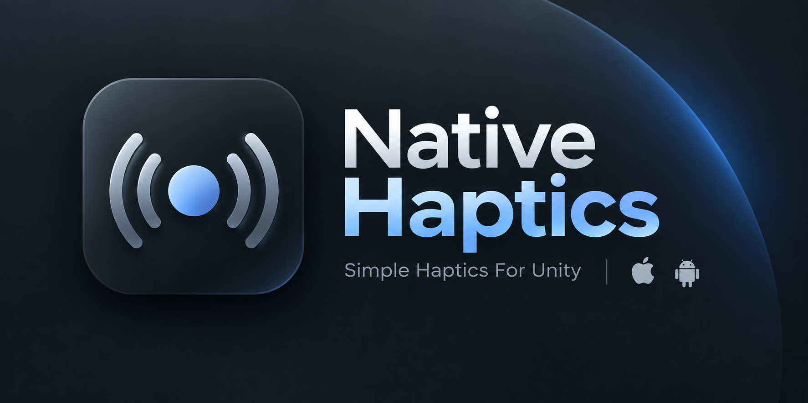

# Native Haptics (Español)

🌐 **Idiomas:** [English](README.md) · [Türkçe](README.tr.md) · [Français](README.fr.md) · Español · [简体中文](README.zh-Hans.md)



**Motor de hápticos nativo, moderno y sin dependencias para Unity.**

`com.ugurarsen.nativehaptics` es un reemplazo ligero y completo para el paquete abandonado NiceVibrations.

Utiliza únicamente APIs públicas del sistema operativo y no contiene **ningún binario nativo `.so` / `.a`**, evitando dependencias binarias nativas obsoletas como `liblofelt_sdk.so`.

## Compatibilidad de plataformas

* **Android:** `VibrationEffect` en API 26+, con retroceso automático (fallback) en dispositivos más antiguos.
* **iOS:** `UIImpactFeedbackGenerator`, `UISelectionFeedbackGenerator` y `UINotificationFeedbackGenerator`.
* **Unity Editor / WebGL / Standalone:** No-op seguro.

---

## Instalación

### OpenUPM — Recomendado

```bash
openupm add com.ugurarsen.nativehaptics
```

### Unity Package Manager — URL de Git

Abre:

**Window → Package Manager → + → Add package from git URL...**

Luego pega:

```text
https://github.com/ugurarsen/NativeHaptics.git
```

### `Packages/manifest.json`

Añade:

```json
{
  "dependencies": {
    "com.ugurarsen.nativehaptics": "https://github.com/ugurarsen/NativeHaptics.git"
  }
}
```

> Este paquete usa una **estructura UPM plana (flat)**: `package.json` está en la raíz del repositorio, por lo que la URL de instalación **no** necesita un fragmento `?path=`.

---

## Inicio rápido

```csharp
using NativeHaptics;

NativeHaptics.PlayHapticType(HapticType.Success);
```

Eso es todo. Consulta la documentación incluida en el paquete (Documentation~) para ver patrones de uso detallados, capas de compatibilidad y notas específicas de plataforma.

---

## Qué incluye

| Característica | Soporte |
|---|---|
| Hápticos predefinidos (Selection, Success, Warning, Failure, Impacts) | iOS + Android |
| Impulso único (`PlayOneShot`) | iOS + Android |
| Vibración constante (`PlayConstant`) | iOS + Android |
| Envolvente de amplitud (`PlayEnvelope`) | iOS + Android |
| Forma de onda personalizada (`PlayPattern`) | iOS + Android |
| Activación / silencio globales (`HapticsEnabled`) | Todas |
| Nivel de salida global (`OutputLevel`) | Todas |
| Cancelar (`Cancel`) | Todas |
| Capa de compatibilidad con NiceVibrations | Sí |
| Capa de compatibilidad con MoreMountains.NiceVibrations | Sí |
| Binarios nativos `.so` / `.a` | **Ninguno** |
| Retroceso para Android API < 26 | Sí |
| No-op en Editor / WebGL / Standalone | Sí |

---

## Documentación

Para la referencia completa de la API, ejemplos de uso, notas de comportamiento por plataforma, guía de migración y documentación de las capas de compatibilidad, abre el botón **View documentation** en la tarjeta del Unity Package Manager o consulta:

[Documentation~/index.es.md](Documentation~/index.es.md)

---

## Licencia

LGPL v3 — ver [LICENSE.md](LICENSE.md).

